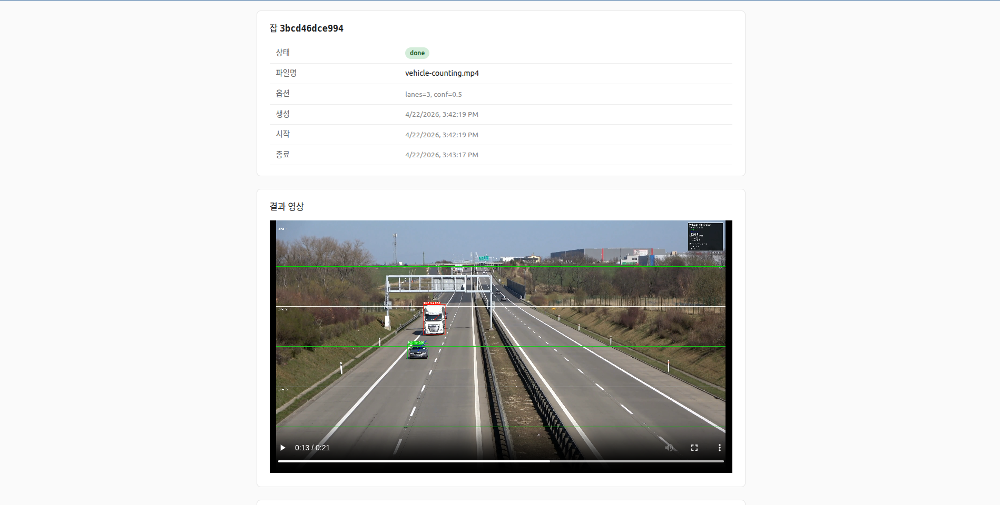

# 🚗 YOLOv8 차선별 차량 카운팅 시스템


**YOLOv8 기반 차량 감지·추적·차선별 카운팅 파이프라인과, 그 위의 FastAPI 백엔드 + Vue 3 프론트엔드.**

<p align="center">
  
  <br />
  <sub>웹 UI의 잡 상세 화면(<code>/jobs/:id</code>) — 업로드된 비디오가 처리된 뒤 결과 영상·메타데이터가 함께 표시된다.</sub>
</p>

---

## 📋 목차

- [주요 기능](#-주요-기능)
- [아키텍처 개요](#-아키텍처-개요)
- [프로젝트 구조](#-프로젝트-구조)
- [빠른 시작](#-빠른-시작)
- [CLI 사용법](#-cli-사용법)
- [웹 UI 사용법](#-웹-ui-사용법)
- [API 레퍼런스](#-api-레퍼런스)
- [설정 (`config.yaml`)](#-설정-configyaml)
- [출력 결과](#-출력-결과)
- [문제 해결](#-문제-해결)
- [문서](#-문서)

---

## ✨ 주요 기능

- **YOLOv8 차량 감지**: nano ~ xlarge 모델 지원, COCO 차량 4 클래스(car/truck/bus/motorcycle) 필터
- **ID 기반 추적**: `YOLO.track(persist=True)` + 자체 `VehicleTracker` 로 경로·속도·생존 관리
- **차선 관리**: auto(균등 분할) / custom(좌표 기반) 모드, 자동 검증 + 카운팅 라인 자동 배치
- **중복 방지 카운팅**: `(track_id, lane_idx, direction)` 키 기반, `min_track_length`/신뢰도 게이트
- **풍부한 시각화**: OpenCV 대시보드 + matplotlib 파이/막대/시간대 차트
- **두 가지 진입점**
  - CLI (`backend/main_system.py`) — 비디오 파일/웹캠 처리
  - Web (FastAPI + Vue 3) — 브라우저에서 업로드 → 진행률 폴링 → 결과 재생
- **GPU 자동 감지** (CUDA 가용 시 torch 로 디바이스 선택)

---

## 🏗 아키텍처 개요

```
┌────────────────────┐   HTTP    ┌──────────────────────────────┐
│  Vue 3 SPA         │ ────────▶ │  FastAPI (uvicorn :8000)     │
│  (Vite :5173)      │           │   ├─ /api/jobs  (업로드/조회) │
│  ─ Pinia / Router  │           │   ├─ /api/health             │
│  ─ axios           │           │   └─ /static/{job_id}/...    │
└────────────────────┘           │                              │
                                 │  ThreadPoolExecutor(1)       │
                                 │   └─ VehicleCountingSystem   │
                                 │        ├─ VehicleDetector    │
                                 │        ├─ VehicleTracker     │
                                 │        ├─ LaneManager        │
                                 │        ├─ VehicleCounter     │
                                 │        └─ VehicleVisualizer  │
                                 │  uploads/   outputs/{id}/    │
                                 └──────────────────────────────┘
```

자세한 내용은 [`docs/architecture.md`](./docs/architecture.md) 와 [`docs/uml.md`](./docs/uml.md) 참고.

---

## 📁 프로젝트 구조

```
vehicle-counting-yolov8/
├── backend/
│   ├── detector.py          # YOLOv8 차량 감지
│   ├── tracker.py           # 트랙 히스토리/속도/정리
│   ├── lane_manager.py      # 차선 + 카운팅 라인 관리
│   ├── counter.py           # 중복 방지 카운팅 + 통계
│   ├── visualizer.py        # OpenCV 오버레이 + matplotlib 차트
│   ├── main_system.py       # VehicleCountingSystem (오케스트레이터 + CLI)
│   ├── run_examples.py      # 7가지 시나리오 예제
│   ├── config.yaml          # 파이프라인 기본 설정
│   ├── requirements.txt
│   ├── uploads/             # (런타임) API 업로드
│   ├── outputs/{job_id}/    # (런타임) 잡별 산출물
│   └── api/                 # FastAPI 어댑터
│       ├── main.py
│       ├── jobs.py          # In-memory JobRegistry
│       ├── pipeline.py      # VehicleCountingSystem 어댑터 + ffmpeg
│       ├── schemas.py       # Pydantic 모델
│       └── routes/{jobs,config}.py
├── frontend/                # Vue 3 + Vite + Pinia + Vue Router + axios
│   ├── src/{api,stores,views,router,types}/
│   └── vite.config.ts       # /api, /static → 127.0.0.1:8000 프록시
├── docs/
│   ├── architecture.md      # 전체 아키텍처 문서
│   └── uml.md               # 컴포넌트/클래스/시퀀스/상태 다이어그램
├── demo.png
├── LICENSE
└── README.md
```

---

## 🚀 빠른 시작

### 요구사항

- Python 3.10+ (검증: py310)
- Node.js 18+ (프론트엔드용)
- (선택) NVIDIA GPU + CUDA — 없으면 CPU 로 동작
- (선택) `ffmpeg` — 결과 영상의 브라우저 호환(H.264) 재인코딩에 사용

### 1) 저장소 클론

```bash
git clone <this-repo>
cd vehicle-counting-yolov8
```

### 2) 백엔드 설치

```bash
cd backend
python -m venv .venv
source .venv/bin/activate       # Windows: .venv\Scripts\activate
pip install --upgrade pip
pip install -r requirements.txt
```

> GPU 를 쓰려면 `torch` 를 CUDA 빌드로 재설치하세요 (예: `pip install torch==2.4.1 --index-url https://download.pytorch.org/whl/cu121`).

### 3) 프론트엔드 설치

```bash
cd ../frontend
npm install
```

### 4) 실행

두 개의 터미널에서:

```bash
# 터미널 A — 백엔드 (backend/ 에서)
uvicorn api.main:app --reload --port 8000

# 터미널 B — 프론트엔드 (frontend/ 에서)
npm run dev
```

브라우저로 http://localhost:5173 접속 → 비디오 업로드 → 진행률 확인 → 결과 영상 재생.

---

## 💻 CLI 사용법

파이프라인만 쓰고 싶다면 `backend/main_system.py` 를 직접 실행한다.

```bash
cd backend

# 비디오 파일 처리
python main_system.py --input your_video.mp4 --output result.mp4

# 웹캠 실시간
python main_system.py --webcam

# 모델/신뢰도/차선 수 오버라이드
python main_system.py --input video.mp4 --model yolov8m.pt --conf 0.6 --lanes 4

# 화면 표시 없이 + 결과 저장
python main_system.py --input video.mp4 --no-display --save-results

# 커스텀 설정 파일
python main_system.py --config custom_config.yaml --input video.mp4
```

### Python 스크립트에서 사용

```python
from main_system import VehicleCountingSystem

system = VehicleCountingSystem("config.yaml")
system.update_config({
    "model":    {"path": "yolov8s.pt", "confidence_threshold": 0.6},
    "lanes":    {"mode": "auto", "count": 4},
    "counting": {"directions": ["both"]},
})
system.process_video("input.mp4", "output.mp4")
print(system.get_system_status())
```

### 대화형 예제

```bash
python run_examples.py
```

7가지 시나리오(기본/고정밀/커스텀 차선/웹캠/배치/벤치마크/시나리오별 설정) 제공.

---

## 🌐 웹 UI 사용법

1. 백엔드(`uvicorn api.main:app`) 와 프론트(`npm run dev`) 를 각각 띄운다.
2. http://localhost:5173 접속 → **백엔드 상태** 패널에서 `ok` + GPU 이름 확인.
3. **새 잡 만들기** 에서 비디오 파일(`.mp4 .avi .mov .mkv .webm`) 선택, 차선 수/신뢰도 입력(선택) 후 **잡 시작**.
4. 자동으로 `/jobs/:id` 상세로 이동 → 프로그레스 바가 live 로 갱신.
5. 완료 시 결과 영상, 카운트 요약 표, 차트 이미지가 그대로 렌더됨.

폴링 전략:

- 홈 화면: 실행 중/대기 중 잡이 하나라도 있으면 3초 간격으로 목록 새로고침
- 상세 화면: `running` 1초, `queued` 2초 간격. `done`/`error` 시 정지

---

## 🔌 API 레퍼런스

베이스 URL: `http://localhost:8000`

| 메소드 | 경로 | 설명 |
|---|---|---|
| `GET`  | `/api/health` | 서버 상태 + GPU 이름 + 버전 |
| `POST` | `/api/jobs` | 비디오 업로드 + 잡 생성 |
| `GET`  | `/api/jobs` | 잡 목록 (최신순) |
| `GET`  | `/api/jobs/{id}` | 단일 잡 상세 (진행률/결과/오류 포함) |
| `GET`  | `/api/config` | `backend/config.yaml` 현재 값 (읽기 전용) |
| `GET`  | `/static/{id}/result.mp4` 등 | 잡별 산출물 정적 서빙 |

### 잡 생성 예

```bash
curl -X POST http://localhost:8000/api/jobs \
  -F "file=@/path/to/video.mp4" \
  -F "lanes=3" \
  -F "confidence_threshold=0.6"
```

응답:

```json
{
  "id": "a1b2c3d4e5f6",
  "status": "queued",
  "filename": "video.mp4",
  "created_at": "2026-04-22T06:45:00Z",
  "progress": 0.0,
  "options": { "lanes": 3, "confidence_threshold": 0.6, "model_path": null }
}
```

### 상태 폴링

```bash
curl http://localhost:8000/api/jobs/a1b2c3d4e5f6
```

`status` 가 `done` 이면 `result.artifacts` 의 URL 을 그대로 `<video>` / `` 에 붙이면 된다.

> ⚠️ MVP 특성상 **잡 레지스트리는 in-memory** 이며 프로세스 재시작 시 소실됩니다. 단일 GPU 가정으로 워커는 1개입니다.

---

## ⚙️ 설정 (`config.yaml`)

`backend/config.yaml` 전체 스키마:

```yaml
model:
  path: "yolov8n.pt"            # nano / small / medium / large / xlarge
  confidence_threshold: 0.5     # 0.0 ~ 1.0
  device: "auto"                # auto | cpu | cuda | cuda:0

lanes:
  mode: "auto"                  # auto | custom
  count: 3                      # auto 모드 차선 수
  margin_top: 50
  margin_bottom: 50
  # custom 모드 예:
  # custom_lanes:
  #   - [0, 240]
  #   - [240, 480]
  #   - [480, 720]

tracking:
  max_history_length: 50
  max_disappeared: 30
  cleanup_interval_frames: 300
  cleanup_max_age_seconds: 300

counting:
  directions: ["both"]          # [up] | [down] | [both]
  min_track_length: 5
  confidence_threshold: 0.5

video:
  input_path: null
  output_path: null
  display_realtime: true        # cv2.imshow
  save_output: false
  frame_skip: 1                 # N=매 N번째 프레임만 처리

visualization:
  enabled: true
  show_bbox: true
  show_track_history: true
  show_lanes: true
  show_statistics: true

output:
  save_results: true
  results_format: "json"
  results_file: "counting_results"

debug:
  log_level: "INFO"             # DEBUG | INFO | WARNING | ERROR
```

API 경로로 제출된 잡은 `JobOptions` (`lanes`, `confidence_threshold`, `model_path`) 로 위 스키마를 부분적으로 덮어쓴다.

---

## 📊 출력 결과

### 디렉터리 레이아웃

CLI 실행 시 현재 디렉터리에, API 실행 시 `backend/outputs/{job_id}/` 에 저장:

- `result.mp4` — 결과 영상 (H.264 재인코딩 성공 시 브라우저 호환)
- `results.json` — 카운팅 통계 전체 dump
- `results_chart.png` — 차량 타입 원형 + 차선 막대 차트
- `results_hourly.png` — 시간대별 스택 바 차트

### `results.json` 스키마 (발췌)

```json
{
  "session_info": {
    "start_time": 1703123456.789,
    "duration_seconds": 120.5,
    "count_directions": ["both"]
  },
  "total_counts": { "car": 124, "truck": 8, "bus": 2, "motorcycle": 9 },
  "lane_counts": {
    "0": { "car": 45, "truck": 3 },
    "1": { "car": 42, "truck": 3 },
    "2": { "car": 37, "truck": 2 }
  },
  "direction_counts": { "up": { "car": 50 }, "down": { "car": 74 } },
  "hourly_counts": { "14": { "car": 124 } },
  "statistics": {
    "peak_hours": [["14", 143]],
    "lane_distribution": { "0": 36.0, "1": 33.6, "2": 30.4 },
    "vehicle_type_distribution": { "car": 86.7, "motorcycle": 6.3, "truck": 5.6, "bus": 1.4 },
    "counting_rate": { "car": 62.0 }
  },
  "recent_events": [ /* 최근 100건 */ ]
}
```

---

## 🔧 문제 해결

### 결과 영상이 브라우저에서 재생되지 않아요

- OpenCV 빌드에 H.264(`avc1`) 코덱이 없으면 `mp4v` 로 떨어지며, 일부 브라우저가 이를 재생하지 못합니다.
- 시스템에 `ffmpeg` 를 설치하면 `libx264 + faststart` 로 자동 재인코딩됩니다:
  ```bash
  sudo apt install ffmpeg    # Ubuntu/Debian
  brew install ffmpeg        # macOS
  ```

### CUDA 관련 오류

```bash
# 강제 CPU 모드
python main_system.py --input video.mp4   # config.yaml 에서 device: "cpu"
```

`torch` 가 CPU 빌드라면 `model.to('cuda')` 에서 실패합니다. CUDA 빌드로 재설치:

```bash
pip install torch==2.4.1 torchvision==0.19.1 --index-url https://download.pytorch.org/whl/cu121
```

### 메모리 부족

```yaml
# config.yaml
model:
  path: "yolov8n.pt"          # 더 작은 모델
video:
  frame_skip: 2               # 프레임 건너뛰기
tracking:
  max_history_length: 20
  max_disappeared: 15
```

### YOLO 모델 자동 다운로드 실패

```bash
# 수동 다운로드
wget https://github.com/ultralytics/assets/releases/download/v0.0.0/yolov8n.pt
# 또는 파이썬으로
python -c "from ultralytics import YOLO; YOLO('yolov8n.pt')"
```

### CORS 오류 (프론트 ↔ 백엔드)

`backend/api/main.py` 의 `allow_origins` 는 기본값이 `http://localhost:5173`, `http://127.0.0.1:5173` 입니다. 다른 오리진에서 호출하려면 여기에 추가하세요.

### Vite 프록시가 `/api` 를 못 찾아요

백엔드가 `:8000` 에서 떠 있는지, `frontend/vite.config.ts` 의 `target` 과 일치하는지 확인합니다.

---

## 📚 문서

- [`docs/architecture.md`](./docs/architecture.md) — 전체 아키텍처, 데이터 흐름, 배포 토폴로지, 확장 지점
- [`docs/uml.md`](./docs/uml.md) — 컴포넌트·클래스·시퀀스·상태 다이어그램 (Mermaid)

---

## 📝 라이선스

[MIT](./LICENSE)
