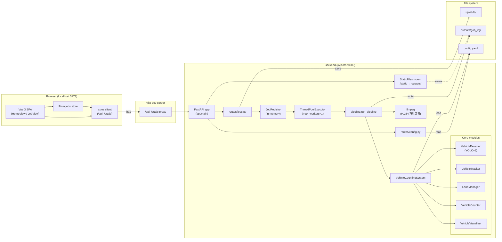
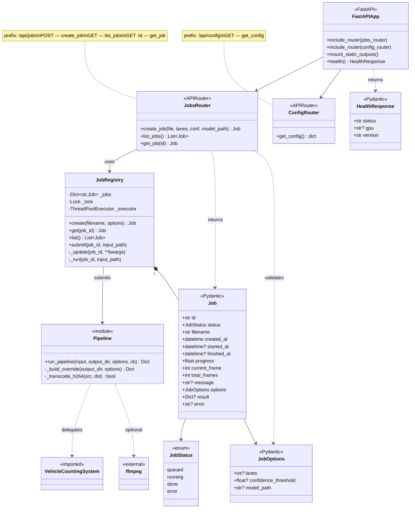
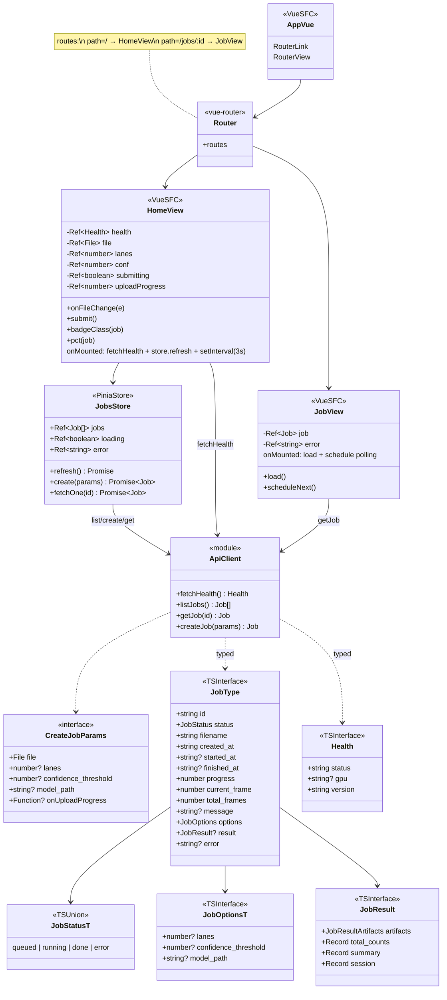
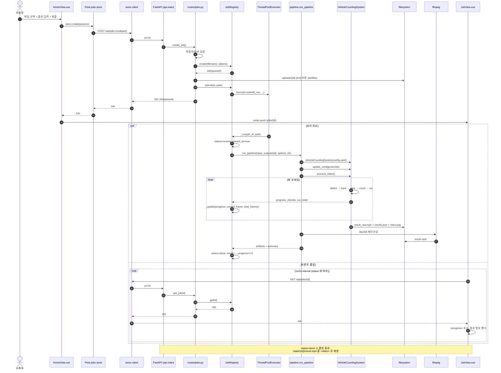
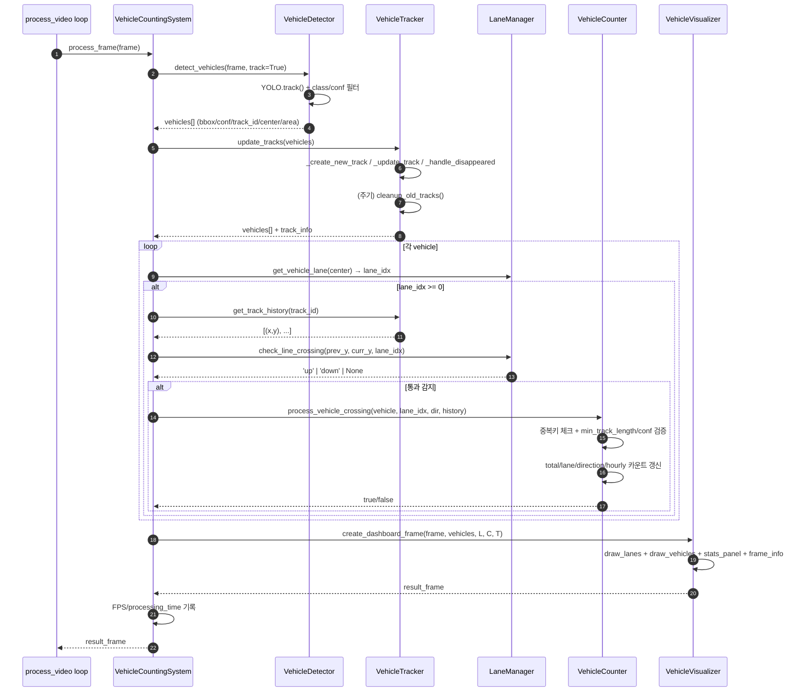
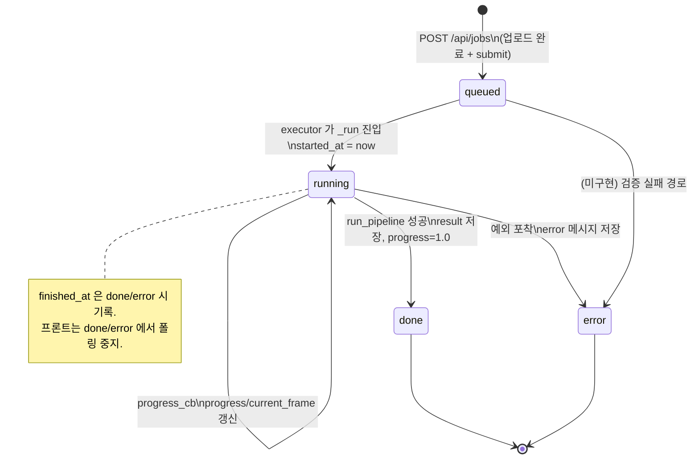
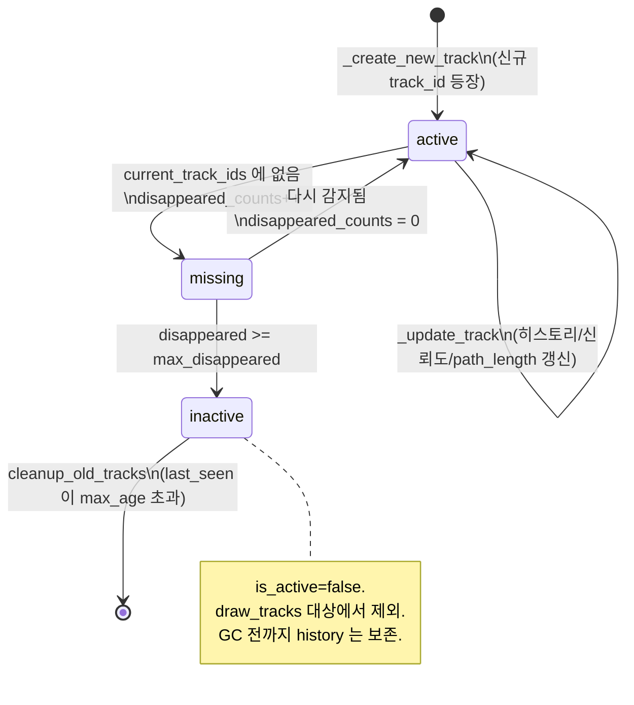

# UML 다이어그램 — Vehicle Counting YOLOv8

본 문서는 프로젝트의 정적/동적 구조를 Mermaid 기반 UML 로 정리한 것이다. 전반 아키텍처 설명은 [`architecture.md`](./architecture.md) 를 참고한다.

수록된 다이어그램:

1. [컴포넌트 다이어그램](#1-컴포넌트-다이어그램) — 시스템 전체 구성 요소와 관계
2. [클래스 다이어그램 (backend core)](#2-클래스-다이어그램--backend-core) — 파이프라인 5 클래스 + 오케스트레이터
3. [클래스 다이어그램 (api layer)](#3-클래스-다이어그램--api-layer) — FastAPI 어댑터 + Pydantic 모델
4. [클래스 다이어그램 (frontend)](#4-클래스-다이어그램--frontend) — Vue/Pinia 컴포넌트 + 타입
5. [시퀀스 다이어그램 — 잡 제출에서 완료까지](#5-시퀀스-다이어그램--잡-제출에서-완료까지)
6. [시퀀스 다이어그램 — 프레임 처리 루프](#6-시퀀스-다이어그램--프레임-처리-루프)
7. [상태 다이어그램 — 잡 라이프사이클](#7-상태-다이어그램--잡-라이프사이클)
8. [상태 다이어그램 — Track 라이프사이클](#8-상태-다이어그램--track-라이프사이클)

---

## 1. 컴포넌트 다이어그램



---

## 2. 클래스 다이어그램 — backend core

`backend/` 의 파이프라인 5 클래스와 오케스트레이터 `VehicleCountingSystem`.

```mermaid
classDiagram
    class VehicleCountingSystem {
        +Dict config
        +Path config_path
        +VehicleDetector detector
        +VehicleTracker tracker
        +LaneManager lane_manager
        +VehicleCounter counter
        +VehicleVisualizer visualizer
        +bool is_running
        +int frame_count
        +deque fps_counter
        +deque processing_times
        +Callable progress_callback
        +__init__(config_path)
        +initialize_modules(w, h)
        +process_frame(frame) ndarray
        +process_video(input, output) bool
        +process_webcam(camera_index) bool
        +update_config(new_config)
        +get_system_status() Dict
        +stop_processing()
        -_load_config(path) Dict
        -_setup_logging()
        -_setup_lanes()
        -_open_video_writer(path, fps, w, h) VideoWriter
        -_save_results()
        -_print_final_results()
    }

    class VehicleDetector {
        +str model_path
        +float conf_threshold
        +str device
        +Dict vehicle_classes
        +YOLO model
        +Dict detection_stats
        +detect_vehicles(frame, track) List~Dict~
        +filter_by_size(vehicles, min, max) List~Dict~
        +filter_by_region(vehicles, region) List~Dict~
        +get_vehicle_crops(frame, vehicles) List
        +draw_detections(frame, vehicles, ...) ndarray
        +update_confidence_threshold(t)
        +get_model_info() Dict
        +get_detection_stats() Dict
        +reset_stats()
        -_load_model() YOLO
        -_process_results(results) List~Dict~
    }

    class VehicleTracker {
        +int max_history_length
        +int max_disappeared
        +int cleanup_interval_frames
        +float cleanup_max_age_seconds
        +Dict tracks
        +defaultdict~deque~ track_history
        +defaultdict disappeared_counts
        +Dict stats
        +update_tracks(vehicles) List~Dict~
        +get_track_history(track_id, max) List
        +calculate_speed(track_id, fps, ppm) float
        +get_average_speed(track_id) float
        +draw_tracks(frame, vehicles, ...) ndarray
        +get_active_tracks() List~int~
        +get_track_info(track_id) Dict
        +cleanup_old_tracks(max_age)
        +export_track_data(track_id) Dict
        +reset()
        -_create_new_track(id, vehicle)
        -_update_track(id, vehicle)
        -_handle_disappeared_tracks(current_ids)
    }

    class LaneManager {
        +int frame_width
        +int frame_height
        +List~Tuple~ lanes
        +List~int~ counting_lines
        +List~str~ lane_names
        +Dict colors
        +Dict line_thickness
        +setup_auto_lanes(n, mt, mb) bool
        +setup_custom_lanes(configs) bool
        +get_vehicle_lane(center) int
        +get_vehicle_lane_info(center) Dict
        +check_line_crossing(prev_y, curr_y, lane_idx) str
        +draw_lanes(frame, ...) ndarray
        +draw_roi(frame, roi) ndarray
        +get_lane_stats() Dict
        +export_config(filename)
        +import_config(filename) bool
        +update_frame_size(w, h)
        +get_lane_polygons() List
        +reset()
        -_validate_lane_configs(configs) bool
    }

    class VehicleCounter {
        +List~str~ count_directions
        +defaultdict total_counts
        +defaultdict lane_counts
        +defaultdict direction_counts
        +defaultdict hourly_counts
        +Set crossed_vehicles
        +List counting_events
        +int min_track_length
        +float confidence_threshold
        +float counting_session_start
        +process_vehicle_crossing(vehicle, lane, dir, history) bool
        +get_total_counts() Dict
        +get_lane_counts() Dict
        +get_direction_counts() Dict
        +get_hourly_counts() Dict
        +get_counting_rate(window) Dict
        +get_peak_hours() List
        +get_lane_distribution() Dict
        +get_vehicle_type_distribution() Dict
        +get_counting_statistics() Dict
        +get_summary_report() str
        +draw_counting_info(frame, pos) ndarray
        +draw_lane_counts(frame, positions) ndarray
        +export_results(filename, output_dir)
        +import_results(filename) bool
        +set_counting_parameters(...)
        +reset_counts()
        -_validate_counting_conditions(...) bool
        -_execute_counting(...)
        -_log_counting_event(...)
    }

    class VehicleVisualizer {
        +Dict config
        +draw_vehicles(frame, vehicles) ndarray
        +draw_lanes(frame, lane_manager) ndarray
        +draw_statistics_panel(frame, counter, pos) ndarray
        +draw_speed_info(frame, vehicle, tracker) ndarray
        +draw_counting_zones(frame, lane_manager) ndarray
        +create_dashboard_frame(frame, vehicles, lm, ct, tr) ndarray
        +create_counting_chart(counter, save_path) Figure
        +create_hourly_chart(counter, save_path) Figure
        +create_heatmap(counter, save_path) Figure
        +create_summary_video_frame(counter, size) ndarray
        +create_comparison_frame(frames, labels) ndarray
        +save_visualization_config(filename)
        +load_visualization_config(filename) bool
        +update_display_settings(**kwargs)
        -_update_config(config)
        -_draw_vehicle_bbox(frame, vehicle) ndarray
        -_draw_track_history(frame, vehicle) ndarray
        -_draw_direction_arrow(frame, p1, p2, color)
        -_draw_label(frame, text, pos, color)
        -_draw_total_counts(frame, counter, x, y) int
        -_draw_lane_counts(frame, counter, x, y) int
        -_draw_rates(frame, counter, x, y) int
        -_calculate_panel_height(counter) int
        -_get_matplotlib_color(vtype) str
        -_draw_frame_info(frame) ndarray
    }

    VehicleCountingSystem --> VehicleDetector : uses
    VehicleCountingSystem --> VehicleTracker : uses
    VehicleCountingSystem --> LaneManager : uses
    VehicleCountingSystem --> VehicleCounter : uses
    VehicleCountingSystem --> VehicleVisualizer : uses
    VehicleVisualizer ..> VehicleCounter : reads stats
    VehicleVisualizer ..> LaneManager : reads lanes
    VehicleVisualizer ..> VehicleTracker : reads speed
    VehicleCounter ..> LaneManager : lane_idx
```



---

## 3. 클래스 다이어그램 — api layer

FastAPI 어댑터와 Pydantic 모델. `backend/api/` 범위.



---

## 4. 클래스 다이어그램 — frontend

`frontend/src/` 의 Vue 컴포넌트, Pinia 스토어, axios 클라이언트, TS 타입.



---

## 5. 시퀀스 다이어그램 — 잡 제출에서 완료까지



---

## 6. 시퀀스 다이어그램 — 프레임 처리 루프

`VehicleCountingSystem.process_frame()` 내부. 매 프레임당 5 단계.



---

## 7. 상태 다이어그램 — 잡 라이프사이클



---

## 8. 상태 다이어그램 — Track 라이프사이클

`VehicleTracker` 내부 트랙 한 개의 상태.



---

## 부록 — 다이어그램 렌더링

- GitHub, GitLab, VS Code Markdown Preview Enhanced, 대부분의 최신 IDE 에서 Mermaid 블록은 자동 렌더된다.
- 로컬 이미지로 추출하려면 `@mermaid-js/mermaid-cli` (`mmdc`) 사용:
  ```bash
  npx -p @mermaid-js/mermaid-cli mmdc -i docs/uml.md -o docs/uml.png
  ```
